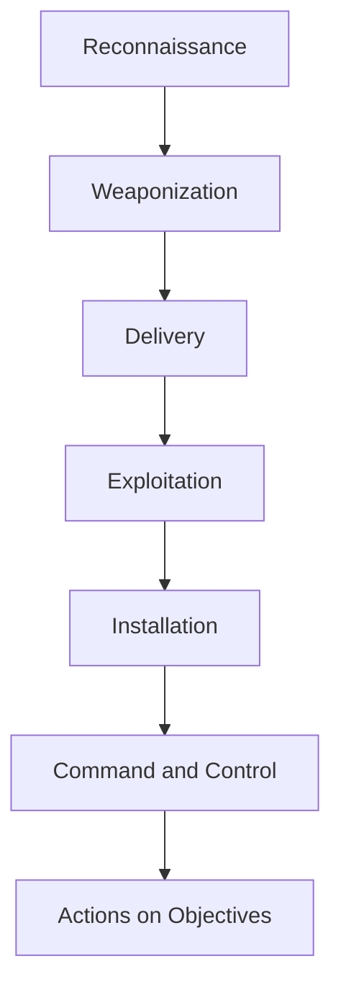

# Cyber Kill Chain

**Module:** Cyber Defence Frameworks  
**Platform:** TryHackMe — SOC Level 1  
**Status:** Completed  
**Completed:** 2026-09-27

> This learning note summarizes the framework and my analyst takeaways in my own words. It intentionally excludes room answers, flags, and step-by-step solutions.

## Objective

Understand the seven stages of the Lockheed Martin Cyber Kill Chain, recognize the evidence an intrusion can produce at each stage, and identify opportunities for prevention, detection, investigation, and response.

## Framework Overview

The Cyber Kill Chain models a targeted intrusion as a sequence of seven stages. Defenders do not need to wait until the final stage: disrupting any link can prevent the adversary from reaching the objective.

| Stage | Adversary Goal | Evidence a SOC Analyst May Observe | Defensive Opportunities |
|---|---|---|---|
| Reconnaissance | Research the target, people, systems, and exposed services | Scanning, enumeration, unusual browsing, OSINT collection, repeated requests | External attack-surface monitoring, rate limiting, exposure reduction |
| Weaponization | Combine an exploit with a payload | Often occurs outside the victim environment; intelligence may reveal malware builders or campaign infrastructure | Threat intelligence, malware analysis, vulnerability management |
| Delivery | Transfer the weapon to the victim | Phishing email, malicious attachment/link, USB activity, watering-hole traffic | Email security, web filtering, attachment sandboxing, awareness training |
| Exploitation | Trigger a vulnerability or user action to execute code | Office child processes, browser exploitation, suspicious script execution, exploit alerts | Patch management, exploit prevention, EDR behavior rules |
| Installation | Establish malware, a backdoor, or persistence | Web shells, new services, Run keys, startup items, dropped files, timestamp manipulation | File-integrity monitoring, EDR, service/registry auditing, application control |
| Command and Control | Communicate with compromised systems | Periodic beaconing, unusual HTTP/HTTPS, DNS tunneling, rare destinations | DNS/proxy monitoring, egress filtering, network detection and response |
| Actions on Objectives | Achieve the mission: steal, disrupt, encrypt, or manipulate | Credential theft, privilege escalation, lateral movement, collection, exfiltration, backup deletion | DLP, segmentation, privileged-access controls, immutable backups, incident response |

## Attack Flow

## Stage-by-Stage Analyst Notes

### 1. Reconnaissance

Reconnaissance may be passive or active. Passive reconnaissance relies on public information such as company websites, job postings, social media, certificate transparency, and public DNS data. Active reconnaissance interacts with target infrastructure through scanning, enumeration, or probing.

**Analyst perspective:** External telemetry is limited during passive reconnaissance, so attack-surface management and threat intelligence become especially valuable.

### 2. Weaponization

The adversary prepares the attack by combining an exploit or delivery mechanism with a payload. This may include malicious documents, scripts, loaders, or customized malware.

**Analyst perspective:** Weaponization usually happens outside the monitored environment. Detection therefore depends on intelligence, malware analysis, and controls applied during delivery or execution.

### 3. Delivery

Delivery is how the payload reaches the victim. Common methods include spearphishing attachments, malicious links, compromised websites, removable media, and supply-chain channels.

**Analyst perspective:** Review message headers, sender/domain reputation, attachment type and hash, URL redirects, sandbox results, and whether the user interacted with the content.

### 4. Exploitation

Exploitation causes attacker-controlled code to execute. It may abuse a software vulnerability, a public-facing application, a macro, a script interpreter, or a user's decision to open malicious content.

**Analyst perspective:** Correlate the initial event with process creation, command lines, parent-child relationships, network connections, and vulnerability context.

### 5. Installation

The attacker installs malware, a backdoor, or another persistence mechanism to maintain access. Examples include web shells, malicious services, Registry Run keys, startup folders, and other autostart mechanisms. Timestomping may be used as defense evasion to make malicious files appear less suspicious.

**Analyst perspective:** Look for unexpected files in web roots, web-server processes spawning shells, new or modified services, unusual registry changes, startup artifacts, and inconsistent file timestamps.

### 6. Command and Control

The compromised host communicates with infrastructure controlled by the adversary. HTTP/HTTPS can blend with normal web traffic, while DNS can be abused to carry commands or data. Regular or irregular beaconing may reveal the channel.

**Analyst perspective:** A common port is not proof of legitimacy. Validate the initiating process, destination age and reputation, TLS or DNS behavior, timing, volume, and host baseline.

### 7. Actions on Objectives

The adversary performs the activity that motivated the intrusion. This can include credential theft, privilege escalation, internal discovery, lateral movement, data collection, exfiltration, encryption, destruction, or disruption. Deleting backups and shadow copies may prevent recovery.

**Analyst perspective:** Monitor sensitive file access, privilege changes, authentication across multiple hosts, archive creation, unusual outbound transfer, mass file modification, and recovery-tool abuse.

## SOC Investigation Workflow

1. Identify the earliest confirmed malicious or suspicious event.
2. Build a timeline across email, endpoint, identity, DNS, proxy, firewall, and application telemetry.
3. Map each supported observation to a Kill Chain stage.
4. Record the **Who, What, When, Where, and Why** for every key event.
5. Distinguish confirmed facts from hypotheses.
6. Determine which controls detected the activity and which controls failed or were absent.
7. Contain affected systems and accounts according to severity and scope.
8. Hunt for the same indicators and behaviors across the environment.
9. Convert the investigation into detection improvements and documented lessons learned.

## Detection and Response Matrix

| Stage | Example Data Sources | Example SOC Action |
|---|---|---|
| Reconnaissance | WAF, IDS, DNS, external exposure data | Identify scanning patterns and reduce exposed services |
| Delivery | Email gateway, proxy, sandbox | Quarantine content and identify recipients |
| Exploitation | EDR, Sysmon, application logs | Reconstruct process execution and validate exploit activity |
| Installation | File, registry, service, startup, web-server telemetry | Remove persistence and preserve forensic evidence |
| Command and Control | DNS, proxy, firewall, NDR, TLS metadata | Block infrastructure and isolate affected endpoints |
| Actions on Objectives | DLP, identity, file audit, backup, cloud logs | Stop data loss or impact and escalate incident response |

## Strengths and Limitations

### Strengths

- Presents an intrusion as an understandable sequence.
- Helps analysts build timelines and communicate attack progression.
- Highlights multiple opportunities to disrupt an attack.
- Supports control-gap analysis and incident retrospectives.

### Limitations

- Real attacks may skip, repeat, or reorder stages.
- The model is oriented toward perimeter-based malware intrusions.
- It provides less detail for insider threats, cloud-native activity, and complex post-compromise behavior.
- MITRE ATT&CK and the Unified Kill Chain provide more granular technique coverage and should be used alongside it.

## Practical Lab Result

- Completed the Cyber Kill Chain room and its practical classification exercise.
- Applied the framework to a real-world breach scenario.
- Mapped adversary actions to the relevant stages.
- Verified the practical result and room conclusion.
- Preserved screenshots as private learning evidence; direct answers and flags are excluded from this public write-up.

## Skills Demonstrated

- Explained all seven Cyber Kill Chain stages.
- Distinguished delivery, exploitation, installation, and command-and-control activity.
- Identified persistence, beaconing, exfiltration, and impact indicators.
- Mapped endpoint and network evidence to attack progression.
- Built a structured SOC investigation and reporting workflow.
- Evaluated the framework's strengths and limitations.
- Connected the Cyber Kill Chain to MITRE ATT&CK and the Unified Kill Chain.

## References

- [Lockheed Martin — Cyber Kill Chain](https://www.lockheedmartin.com/en-us/capabilities/cyber/cyber-kill-chain.html)
- [Lockheed Martin — Intelligence-Driven Computer Network Defense](https://www.lockheedmartin.com/content/dam/lockheed-martin/rms/documents/cyber/LM-White-Paper-Intel-Driven-Defense.pdf)
- [MITRE ATT&CK — Enterprise Tactics](https://attack.mitre.org/tactics/enterprise/)
- [CISA — Insider Threat Mitigation](https://www.cisa.gov/topics/physical-security/insider-threat-mitigation)
- [TryHackMe — Cyber Kill Chain](https://tryhackme.com/room/cyberkillchainzmt)
