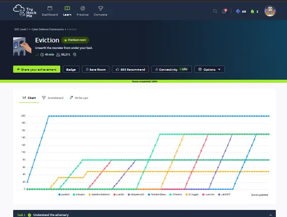

# Eviction

## Room Summary

This room uses MITRE ATT&CK Navigator to investigate a suspected APT28 intrusion against a fictional research organization. The exercise follows adversary behavior across the attack lifecycle and translates threat-intelligence reporting into detection priorities for a SOC.

The key lesson is that a threat group profile is not simply a list of indicators. ATT&CK techniques provide a structured way to connect observed behavior, required telemetry, defensive hypotheses, and detection opportunities.

> This write-up documents methodology and defensive lessons only. Direct room answers and flags are intentionally excluded.

## Objectives

- Use ATT&CK Navigator to explore an adversary-specific technique layer.
- Map observed behaviors to tactics, techniques, and sub-techniques.
- Follow activity from reconnaissance and initial access through collection and command and control.
- Convert threat-intelligence findings into SOC data-source and detection requirements.
- Prioritize detections that remain useful when individual indicators change.

## Adversary-Centric ATT&CK Mapping

The investigation centered on APT28 and highlighted activity spanning multiple ATT&CK tactics. The mapping below summarizes the behaviors studied without reproducing the room's question-and-answer sequence.

| ATT&CK tactic | Technique or sub-technique | ATT&CK ID | Defensive focus |
|---|---|---|---|
| Reconnaissance | Phishing for Information: Spearphishing Link | T1598.003 | Monitor credential-harvesting campaigns, lookalike domains, and suspicious link telemetry |
| Resource Development | Compromise Accounts: Email Accounts | T1586.002 | Detect unusual sending behavior, forwarding rules, OAuth abuse, and account takeover |
| Initial Access / Execution | User Execution: Malicious Link and Malicious File | T1204.001 / T1204.002 | Correlate email delivery, link clicks, file writes, and child-process execution |
| Execution | Command and Scripting Interpreter: PowerShell / Windows Command Shell | T1059.001 / T1059.003 | Capture PowerShell script blocks, command lines, parent processes, and encoded content |
| Persistence | Registry Run Keys / Startup Folder | T1547.001 | Alert on new or modified autorun values and execution from unusual paths |
| Defense Evasion | System Binary Proxy Execution: Rundll32 | T1218.011 | Review suspicious DLL paths, exports, network activity, and unusual parent-child chains |
| Discovery | Network Sniffing | T1040 | Detect packet-capture tools, raw-socket use, promiscuous mode, and unexpected capture files |
| Lateral Movement | Remote Services: SMB/Windows Admin Shares | T1021.002 | Correlate remote share access, service creation, authentication, and file transfer events |
| Collection | Data from Information Repositories: SharePoint | T1213.002 | Monitor abnormal bulk access, downloads, API use, and sensitive repository queries |
| Command and Control | Proxy: External Proxy / Multi-hop Proxy | T1090.002 / T1090.003 | Identify relay infrastructure, anomalous proxy chains, Tor/VPN use, and inconsistent destinations |

## Investigation Method

### 1. Start with the adversary profile

The ATT&CK group page provides a documented set of techniques associated with the threat actor. Navigator then makes those behaviors easier to compare across tactics and prioritize as a defensive coverage layer.

### 2. Follow the behavior across the lifecycle

Rather than treating each technique in isolation, the room connected a plausible sequence:

1. Credential-focused spearphishing and compromised email infrastructure.
2. User-driven execution through malicious links or files.
3. PowerShell and command-shell activity after execution.
4. Registry-based persistence and proxy execution through a trusted Windows binary.
5. Network discovery and lateral movement over administrative shares.
6. Collection from an enterprise information repository.
7. Obfuscated command-and-control routing through proxy infrastructure.

### 3. Convert intelligence into telemetry requirements

An ATT&CK mapping becomes operational when each technique is paired with the logs required to observe it.

| Telemetry source | What it contributes |
|---|---|
| Secure email gateway | Sender, URL, attachment, delivery, and click context |
| Identity provider / cloud audit | Sign-ins, account changes, forwarding rules, OAuth grants, and repository access |
| EDR / Sysmon | Process creation, command lines, registry changes, DLL execution, and network connections |
| PowerShell logging | Script-block, module, and transcription evidence |
| Windows security logs | Authentication, share access, and remote-service activity |
| DNS / proxy / firewall | Domain resolution, outbound connections, relays, and multi-hop behavior |
| SharePoint audit | File access, downloads, searches, API activity, and bulk collection patterns |

## Detection Engineering Opportunities

### Suspicious PowerShell or command-shell execution

Prioritize interpreters launched by Office applications, browsers, archive utilities, or script hosts. Look for encoded commands, hidden windows, download cradles, and execution from user-writable paths.

### Registry autorun persistence

Detect writes to common Run and RunOnce locations, then correlate the value data with file reputation, signer information, user context, and the first subsequent execution.

### Rundll32 proxy execution

Rundll32 is legitimate, so the analytic should focus on abnormal DLL locations, unusual command-line syntax, remote content, suspicious exports, unexpected parent processes, and follow-on network activity.

### SMB lateral movement

Correlate successful remote authentication with administrative-share access, remote file creation, service installation, and execution on the destination host. Baseline legitimate administration to reduce false positives.

### Information-repository collection

For SharePoint, useful signals include unusual download volume, enumeration of sensitive sites, access from new devices or locations, atypical API clients, and activity inconsistent with the user's role.

### Proxy-based command and control

External or chained proxies may hide the original controller. Detection should combine endpoint process context, destination age and reputation, TLS metadata, connection timing, and deviations from normal proxy routes.

## Skills Gained

- Used MITRE ATT&CK Navigator for adversary-centric analysis.
- Mapped a threat group's behaviors across multiple ATT&CK tactics.
- Translated CTI into concrete logging and detection requirements.
- Connected email, identity, endpoint, network, Windows, and cloud evidence.
- Identified detection opportunities for PowerShell, registry persistence, Rundll32, SMB, SharePoint, and proxy-based C2.
- Distinguished an ATT&CK technique from the telemetry and analytic needed to detect it.

## Key Takeaways

- ATT&CK Navigator is most valuable when used as a coverage and prioritization tool, not as a checklist.
- Adversary profiles guide hypotheses but do not prove attribution on their own.
- Technique-level detections are more resilient than isolated IP, domain, or hash indicators.
- Multi-source correlation is necessary to reconstruct a complete intrusion path.
- Detection logic should reflect local baselines, approved administrative behavior, and business context.

## Completion Evidence

- **Platform:** TryHackMe
- **Room:** Eviction
- **Completed:** September 28, 2026
- **Module:** Cyber Defence Frameworks

## References

- [TryHackMe — Eviction](https://tryhackme.com/room/eviction)
- [MITRE ATT&CK — APT28](https://attack.mitre.org/groups/G0007/)
- [MITRE ATT&CK Navigator](https://mitre-attack.github.io/attack-navigator/)
- [MITRE ATT&CK — Registry Run Keys / Startup Folder](https://attack.mitre.org/techniques/T1547/001/)
- [MITRE ATT&CK — Proxy](https://attack.mitre.org/techniques/T1090/)

