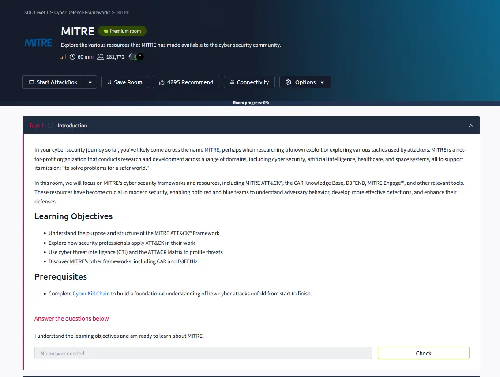
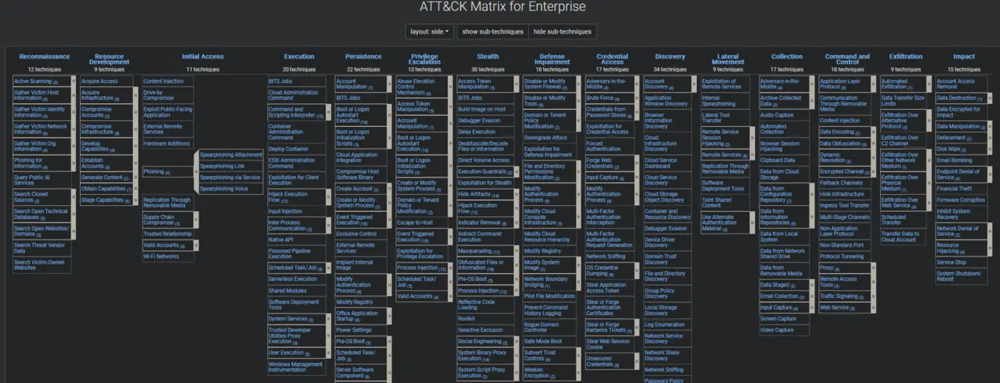
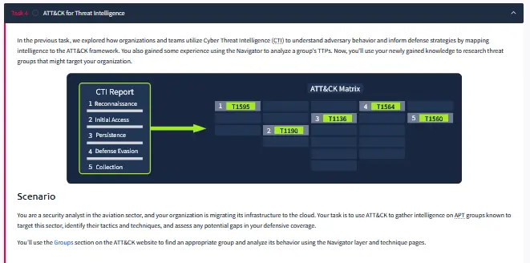
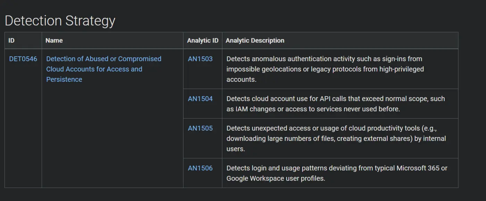
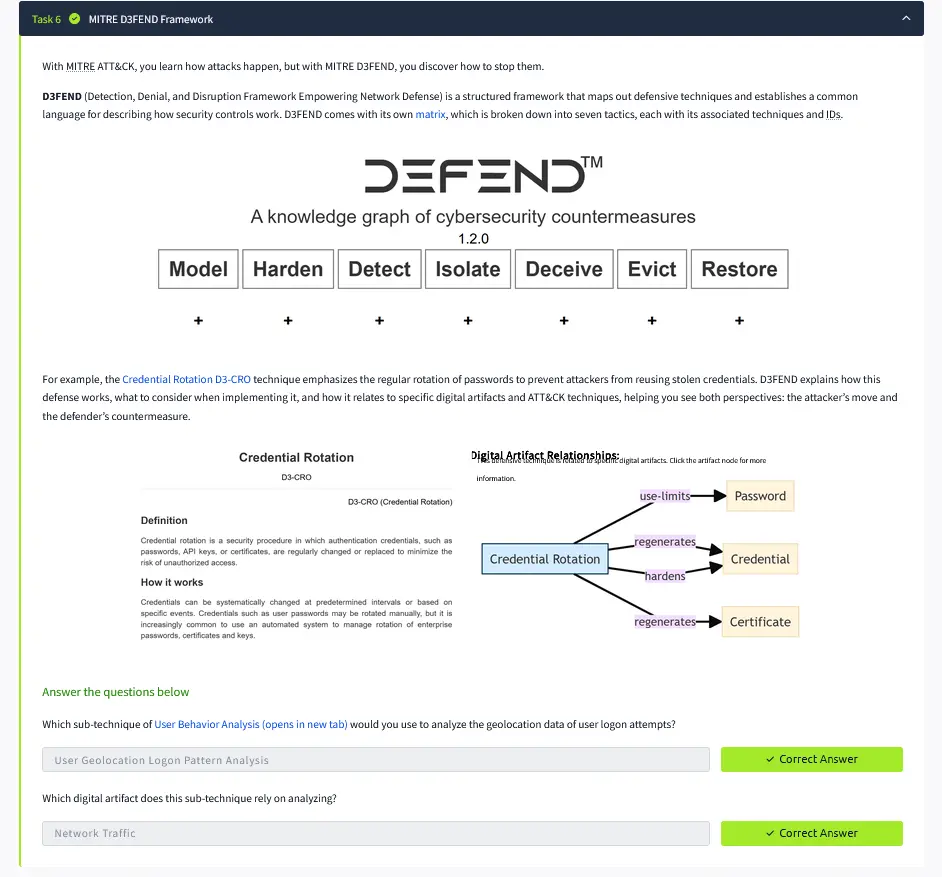
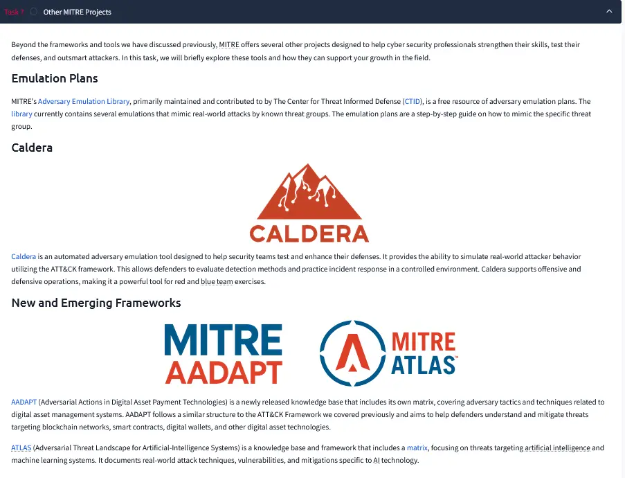
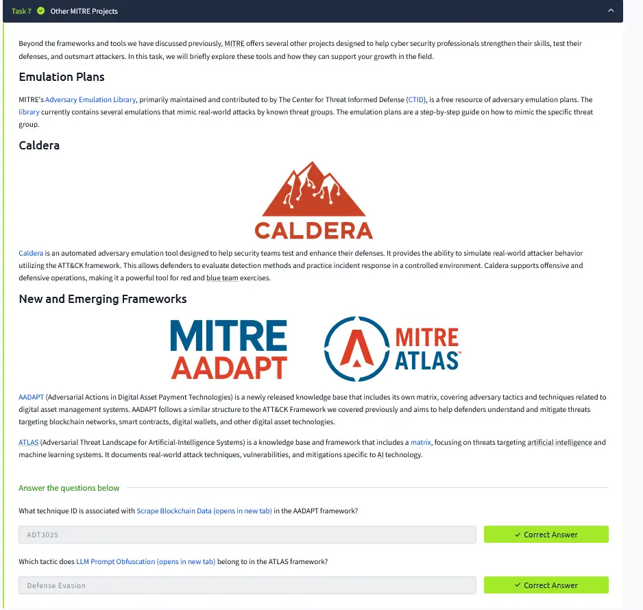
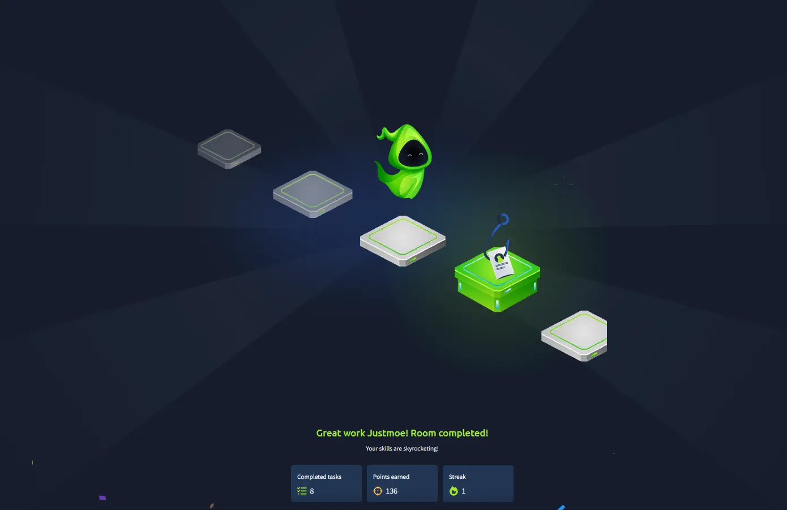

# MITRE ATT&CK

## Room Summary

This room introduced the MITRE ATT&CK knowledge base and demonstrated how SOC teams use it to describe adversary behavior, investigate incidents, build detections, assess defensive coverage, and emulate realistic attacks. The room also explored ATT&CK Navigator, Cyber Analytics Repository (CAR), MITRE D3FEND, CALDERA, the Adversary Emulation Library, AADAPT, and ATLAS.

## Learning Objectives

- Explain the relationship between tactics, techniques, sub-techniques, procedures, groups, software, and mitigations.
- Navigate the Enterprise ATT&CK matrix and individual technique pages.
- Use ATT&CK Navigator to visualize technique coverage and investigation findings.
- Map threat intelligence and observed behavior to ATT&CK.
- Understand how ATT&CK supports detection engineering, adversary emulation, and defensive gap analysis.
- Identify complementary MITRE projects for analytics, countermeasures, emulation, digital assets, and AI security.

## ATT&CK Structure

MITRE ATT&CK is a behavior-based knowledge base built from observed adversary activity. It provides a common language for describing what an adversary is trying to achieve and how the adversary performs the action.

| Component | Meaning | SOC use |
|---|---|---|
| **Tactic** | The adversary's tactical objective — the **why**. | Organizes activity by goals such as Initial Access, Persistence, and Exfiltration. |
| **Technique** | The general method used to achieve a tactic — the **how**. | Maps observable behavior to a stable ATT&CK identifier. |
| **Sub-technique** | A more specific implementation of a technique. | Improves detection precision and reporting detail. |
| **Procedure** | A real-world implementation used by a specific actor or tool. | Connects threat intelligence to observed evidence. |
| **Group** | A tracked adversary or intrusion set. | Supports actor-focused investigations and emulation. |
| **Software** | Malware or legitimate tooling associated with behaviors. | Helps analysts connect tools with techniques and groups. |
| **Mitigation** | Defensive action that can reduce a technique's effectiveness. | Supports control selection and remediation planning. |

ATT&CK is not a fixed linear kill chain. Multiple tactics can occur simultaneously, techniques may support more than one tactic, and attackers may repeat behaviors across different hosts.

## Enterprise ATT&CK Matrix

The Enterprise matrix provides a tactical view of adversary behavior across common enterprise platforms. Each column represents a tactic, while the entries beneath it represent techniques and sub-techniques.

An analyst can use the matrix to:

- classify observed commands, processes, authentication activity, and network behavior;
- identify missing telemetry and detection coverage;
- communicate findings consistently across SOC, threat intelligence, incident response, and red-team functions;
- prioritize detections around techniques relevant to the organization's threat model.

## ATT&CK Navigator

ATT&CK Navigator creates color-coded matrix layers for analysis and communication. Useful applications include:

- marking techniques observed during an incident;
- comparing defensive coverage against a threat group;
- scoring detection confidence or control maturity;
- identifying gaps between adversary capabilities and existing monitoring;
- combining multiple layers for purple-team planning.

Navigator layers are analytical views, not proof that a technique is fully detected or prevented. Coverage should be validated against telemetry, analytic logic, and test results.

## Threat Intelligence Mapping

A practical ATT&CK mapping workflow is:

1. Extract behaviors from a report, alert, or incident timeline.
2. Focus on what the adversary did instead of matching keywords alone.
3. Select the most specific supported technique or sub-technique.
4. Record the evidence and confidence level.
5. Map the technique to the appropriate tactic in the current context.
6. Validate the mapping against the official technique description and procedure examples.

This behavior-first approach reduces over-mapping and prevents unsupported assumptions about actor identity.

## Scenario Analysis

The practical scenario required translating a sequence of adversary actions into ATT&CK techniques and using the matrix to understand the attack path.

The exercise reinforced that the same incident may include discovery, execution, credential access, lateral movement, collection, command and control, and impact behaviors. ATT&CK helps describe these actions at a detailed level without forcing them into a strictly linear sequence.

## Detection Engineering with ATT&CK

ATT&CK can guide detection development by connecting a behavior to the telemetry and analytics needed to observe it.

A defensible detection workflow is:

1. Choose a relevant technique based on organizational risk and threat intelligence.
2. Review the technique's data components, procedure examples, and known behaviors.
3. Identify available endpoint, identity, network, cloud, or application telemetry.
4. Build analytics around behavior rather than a single fragile indicator.
5. Test with controlled emulation and record blind spots.
6. Tune the analytic and reassess coverage as the environment changes.

ATT&CK mapping should not be treated as a compliance checkbox. A technique is not covered merely because a rule is tagged with its ID; the analytic must be tested against realistic behavior.

## MITRE CAR and D3FEND

**Cyber Analytics Repository (CAR)** provides analytics mapped to ATT&CK techniques. It can help defenders study detection ideas, required data, and analytic logic.

**MITRE D3FEND** describes defensive techniques and their relationships to offensive behavior. ATT&CK explains adversary behavior; D3FEND helps describe possible defensive countermeasures.

Together, the resources can support a practical chain:

`Observed behavior → ATT&CK technique → analytic idea → defensive countermeasure → validation`

## Adversary Emulation

The **Adversary Emulation Library** provides intelligence-driven plans that reproduce behaviors associated with real threat groups. **MITRE CALDERA** can automate controlled adversary-emulation operations using ATT&CK-aligned abilities.

These resources support purple-team exercises, validation of telemetry, and measurement of detection and response performance. Emulation should be authorized, scoped, and executed only in a controlled environment.

## Other MITRE Projects

| Project | Primary focus |
|---|---|
| **CALDERA** | Automated, ATT&CK-aligned adversary emulation. |
| **Adversary Emulation Library** | Intelligence-driven plans based on real-world threat groups. |
| **AADAPT** | Tactics and techniques affecting digital-asset payment technologies, blockchains, smart contracts, and wallets. |
| **ATLAS** | Adversary tactics and techniques affecting AI and machine-learning systems. |

## Practical Validation

The room included research tasks using official MITRE resources and validated the ability to locate technique identifiers, tactics, procedure examples, mitigations, analytics, and relationships across ATT&CK, D3FEND, AADAPT, and ATLAS.

Direct answers and flags are intentionally excluded from this public portfolio. Private learning evidence is retained separately.

## Skills Gained

- Navigated the Enterprise ATT&CK matrix and technique pages.
- Distinguished tactics, techniques, sub-techniques, and procedures.
- Mapped threat-intelligence behaviors to ATT&CK with evidence-based reasoning.
- Used Navigator concepts for coverage visualization and gap analysis.
- Connected ATT&CK techniques with detection analytics and defensive countermeasures.
- Evaluated how adversary-emulation plans and CALDERA validate SOC controls.
- Differentiated ATT&CK, D3FEND, AADAPT, and ATLAS by defensive use case.
- Applied ATT&CK as a common language for SOC reporting, threat hunting, detection engineering, and purple teaming.

## Completion Evidence

Completed all **8 tasks** and earned **136 points** on September 27, 2026.

## Key Takeaways

- ATT&CK describes adversary behavior; it is not a vulnerability scanner, security product, or linear intrusion model.
- Strong mappings are evidence-based and use the most specific supported technique.
- Technique tags alone do not prove detection coverage; telemetry and analytics must be validated.
- Navigator is valuable for communication, prioritization, and gap analysis.
- ATT&CK becomes more operational when combined with CAR, D3FEND, threat intelligence, and controlled emulation.
- AADAPT and ATLAS extend behavior-based analysis into digital-asset and AI/ML security domains.

## References

- [MITRE ATT&CK](https://attack.mitre.org/)
- [Enterprise ATT&CK Matrix](https://attack.mitre.org/matrices/enterprise/)
- [ATT&CK Navigator](https://mitre-attack.github.io/attack-navigator/)
- [MITRE Cyber Analytics Repository](https://car.mitre.org/)
- [MITRE D3FEND](https://d3fend.mitre.org/)
- [MITRE CALDERA](https://caldera.mitre.org/)
- [Center for Threat-Informed Defense — Adversary Emulation Library](https://ctid.mitre.org/resources/adversary-emulation-library/)
- [MITRE AADAPT](https://aadapt.mitre.org/)
- [MITRE ATLAS](https://atlas.mitre.org/)
- [TryHackMe — MITRE](https://tryhackme.com/room/mitre)
