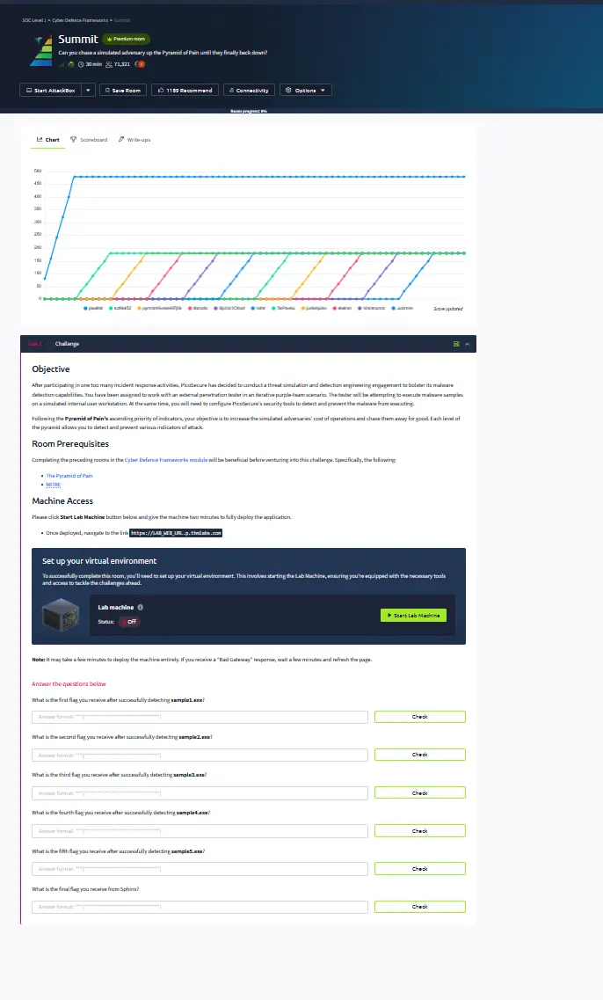
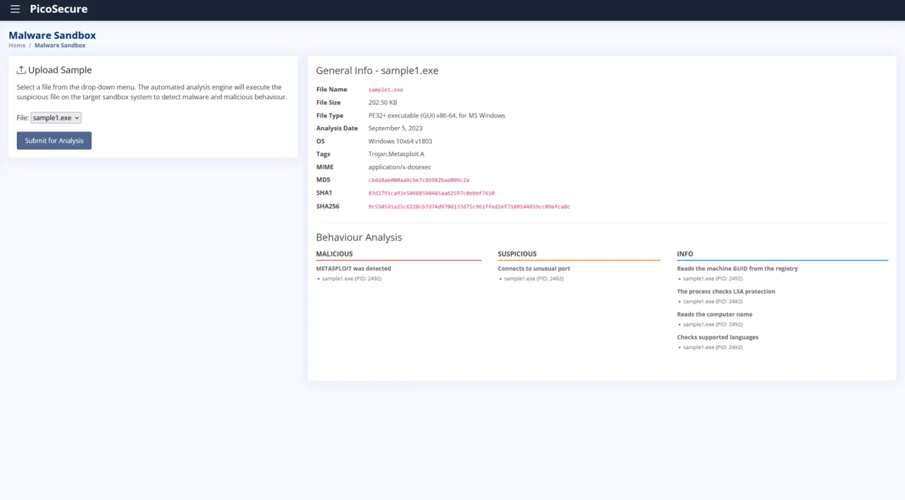
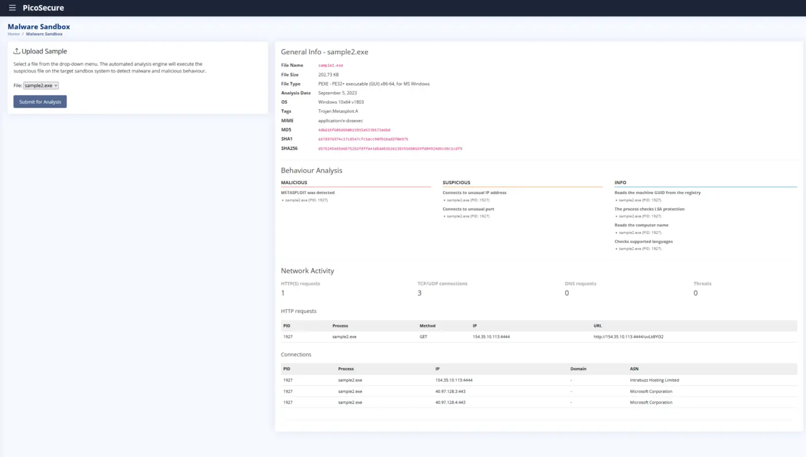
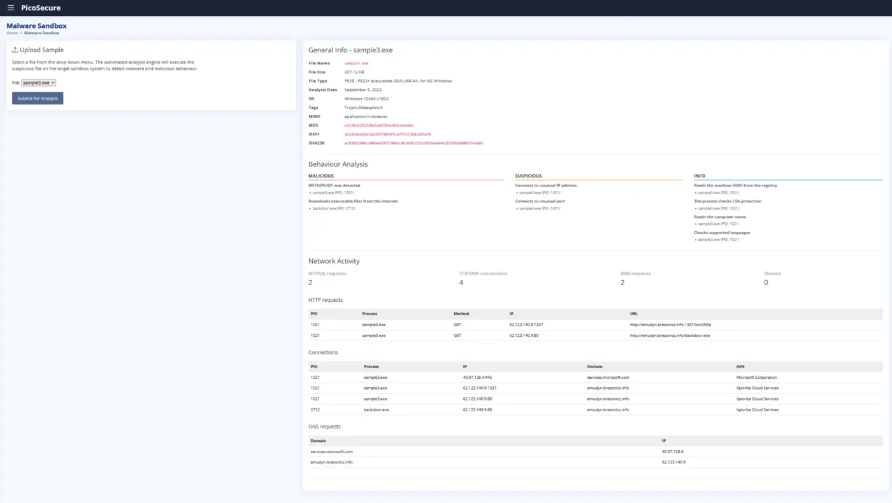
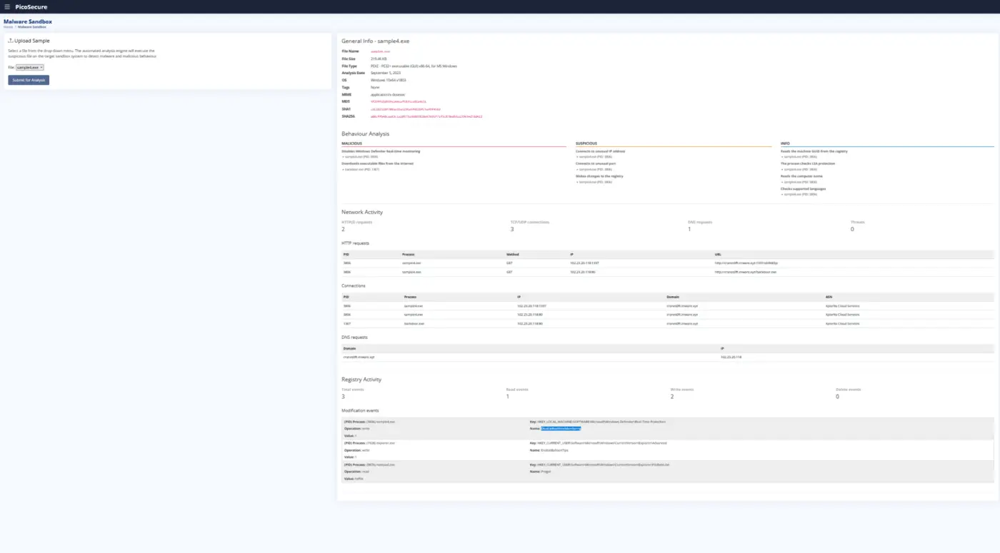
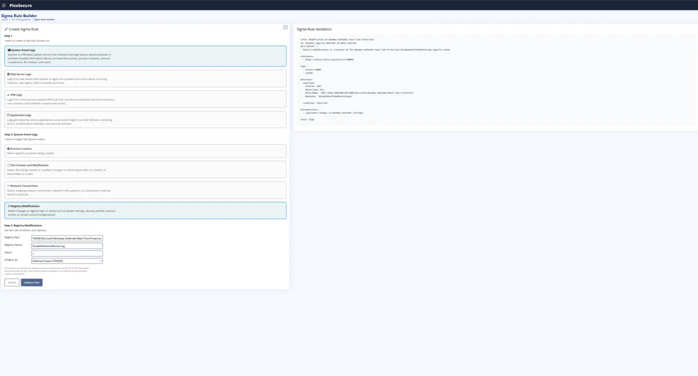
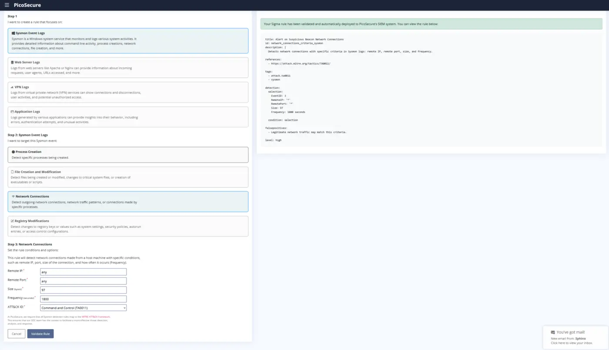
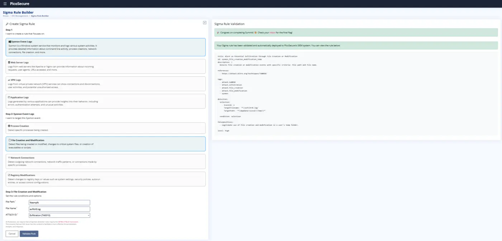

# Summit

## Room Summary

This practical room applies the Pyramid of Pain as a detection-engineering workflow. Five malware samples are analyzed in a sandbox, then progressively more durable controls are created for hashes, network indicators, host artifacts, behavioral patterns, and attacker techniques and procedures.

The exercise demonstrates an important SOC principle: indicators near the bottom of the Pyramid of Pain are quick to block but easy for an adversary to replace. Behavioral detections and TTP-focused analytics are harder to build, but they create more durable defensive value.

> This write-up documents methodology and defensive lessons only. Direct room answers and flags are intentionally excluded.

## Objectives

- Analyze malware sandbox output across static, host, and network telemetry.
- Select an appropriate defensive control for each indicator type.
- Progress from atomic IOC blocking to behavior-based detection.
- Build Sigma-style analytics from Sysmon-compatible events.
- Map defensive logic to relevant MITRE ATT&CK tactics.

## Practical Workflow



| Pyramid layer | Investigation focus | Defensive action | Durability |
|---|---|---|---|
| Hash values | Unique file digests | Add the malicious hash to a blocklist | Low — repacking or changing one byte creates a new hash |
| IP addresses | Command-and-control destination | Add an outbound firewall deny rule | Low to medium — infrastructure can rotate quickly |
| Domain names | Malicious DNS destination | Add a DNS deny rule | Medium — domains are replaceable but require additional setup |
| Host artifacts | Registry and endpoint changes | Detect the artifact with a Sigma rule | Medium to high — forces changes to execution behavior |
| Tools and behavior | Periodic network beaconing | Detect the pattern with a Sigma rule | High — changing behavior may disrupt the attacker's workflow |
| TTPs | Discovery, collection, and staging activity | Detect the procedure rather than a single IOC | Highest — requires the adversary to redesign how objectives are achieved |

## 1. Hash-Based Prevention

The first sample was inspected in the malware sandbox and its unique cryptographic digests were identified. A hash blocklist provides fast prevention and is useful during immediate containment, but it is a brittle control because even a tiny modification produces a different digest.



**Detection lesson:** Hash matching is valuable for known-bad files, but it should be paired with signer, path, process, and behavioral analytics.

## 2. Network IOC Blocking

The second sample's network activity revealed a command-and-control destination. An outbound firewall rule was used to deny communication to the identified external address.



The third sample connected to a malicious domain. A DNS deny rule was the appropriate control because it blocks resolution at the domain layer and can remain effective if the destination IP changes.



**Detection lesson:** Egress controls and DNS visibility are essential, but IP addresses and domains remain replaceable infrastructure. Analysts should pivot from them to the processes, users, timing, and behaviors that generated the traffic.

## 3. Host Artifact Detection

The fourth sample modified a Windows Defender registry setting to disable real-time monitoring. The investigation pivoted from the malware file to the host-side artifact:

```text
Registry path: HKEY_LOCAL_MACHINE\SOFTWARE\Microsoft\Windows Defender\Real-Time Protection
Value name:    DisableRealtimeMonitoring
Value data:    1
```



A Sigma rule was then built around registry modification telemetry and mapped to **Defense Evasion (TA0005)**. This is more durable than a hash rule because it detects the security-control tampering regardless of which binary performs it.



## 4. Periodic Beacon Detection

The fifth sample produced a consistent outbound connection at a 30-minute interval. The important signal was the recurring pattern, not only the destination address.

The resulting analytic used Sysmon network connection telemetry (Event ID 3), a frequency of 1,800 seconds, and ATT&CK **Command and Control (TA0011)** context.



**Detection lesson:** Periodic beacon analytics should combine timing with process, destination, port, packet size, and endpoint context. This reduces dependence on a single IOC and makes infrastructure rotation less effective.

## 5. TTP-Focused Detection

The final scenario focused on commands used for system and network discovery followed by staging collected output in a temporary log file. A file-creation or modification analytic was used to detect the repeatable procedure rather than a particular tool or address.



This layer provides the most defensive leverage because the adversary must change how they collect and prepare information, not merely swap infrastructure or rebuild a payload.

## Detection Engineering Takeaways

- Use atomic indicators for rapid containment, not as the only detection strategy.
- Enrich firewall and DNS alerts with endpoint process context.
- Monitor security-product configuration changes as high-value host artifacts.
- Baseline recurring outbound traffic to identify periodic C2 behavior.
- Write analytics around stable attacker objectives and procedures.
- Map rules to ATT&CK tactics so coverage and gaps can be reviewed consistently.
- Validate rules against representative telemetry before operational deployment.

## Skills Gained

- Applied the Pyramid of Pain from hashes through TTPs.
- Analyzed malware sandbox host and network artifacts.
- Created hash, firewall, DNS, and Sigma-based defensive controls.
- Detected registry-based security-control tampering.
- Detected periodic C2 beaconing using Sysmon network events.
- Built a behavior-focused analytic for collection and staging activity.

## Completion Evidence

- **Platform:** TryHackMe
- **Room:** Summit
- **Completed:** September 28, 2026
- **Tasks:** 1
- **Points:** 180


## References

- [TryHackMe — Summit](https://tryhackme.com/room/summit)
- [David J. Bianco — The Pyramid of Pain](https://detect-respond.blogspot.com/2013/03/the-pyramid-of-pain.html)
- [MITRE ATT&CK](https://attack.mitre.org/)
- [SigmaHQ](https://sigmahq.io/)
- [Microsoft Sysmon](https://learn.microsoft.com/sysinternals/downloads/sysmon)

