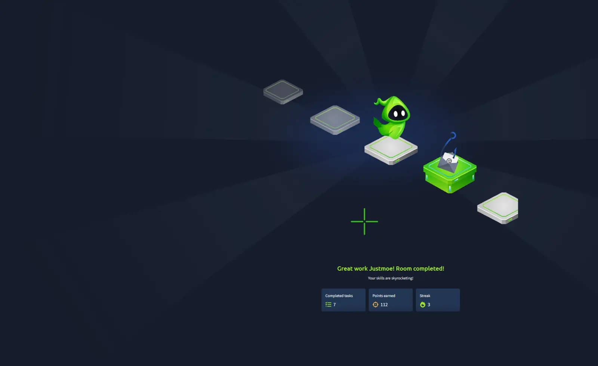

# Phishing Analysis Fundamentals

## Room Summary

This room builds the foundation required to investigate suspicious emails in a SOC. It covers how email addresses are structured, how messages move between servers and clients, how headers and bodies expose technical evidence, and how attackers use social engineering to deliver phishing campaigns.

The practical exercises focused on reading raw email source, tracing delivery information, identifying authentication results, reconstructing an attachment from MIME/Base64 data, safely documenting indicators, and recognizing brand impersonation.

> This write-up documents methodology and defensive lessons only. Direct room answers and flags are intentionally excluded.

## Objectives

- Understand the structure of email addresses and messages.
- Explain the roles of SMTP, DNS, POP3, and IMAP.
- Inspect raw email headers and identify useful investigation fields.
- Analyze plain-text and HTML email bodies.
- Reconstruct MIME attachments encoded with Base64.
- Recognize common phishing techniques and social-engineering indicators.
- Document suspicious indicators safely through defanging.

## Email Anatomy and Delivery

An email address consists of a local part, the @ separator, and a domain. Small spelling changes in the domain can indicate lookalike infrastructure designed to impersonate a trusted organization.

| Component | Investigation value |
|---|---|
| Local part | Identifies the mailbox or claimed sender identity |
| Domain | Connects the message to DNS, mail infrastructure, and brand identity |
| SMTP | Transfers outbound mail between a client and mail server, and between mail servers |
| DNS | Locates the recipient domain's mail infrastructure through MX records |
| POP3 | Downloads messages, commonly for local/offline access |
| IMAP | Keeps messages on the server and synchronizes them across devices |

A simplified delivery sequence is:

1. The sender's client submits the message using SMTP.
2. The sending server queries DNS for the recipient domain's mail exchanger.
3. The message is transferred to the recipient's mail server.
4. The recipient retrieves or synchronizes the message through POP3 or IMAP.

## Header Analysis

The rendered message shows only part of the evidence. Viewing the raw source exposes delivery hops, authentication results, routing details, and metadata that may not appear in the normal inbox view.

| Header field | Why it matters |
|---|---|
| From | Displayed sender identity; can be spoofed or misleading |
| Reply-To | Destination for replies; mismatches can indicate redirection |
| Return-Path | Envelope sender used during delivery and bounce handling |
| Subject | Social-engineering theme, urgency, or impersonation context |
| Date | Claimed send time and timezone |
| Received | Mail-server hops used to reconstruct the delivery path |
| X-Originating-IP | Possible originating client or infrastructure address |
| Authentication-Results | SPF, DKIM, and DMARC evaluation performed by a mail server |

Received headers should be evaluated as a chain, with attention to the earliest trustworthy hop. A header supplied by an attacker is not automatically reliable; trust boundaries and known mail infrastructure matter.

## SPF, DKIM, and DMARC

- **SPF** checks whether the sending IP is authorized for the envelope-sender domain.
- **DKIM** validates a cryptographic signature over selected message content and headers.
- **DMARC** checks alignment between the visible From domain and the authenticated SPF or DKIM domain, then applies the domain owner's policy.

An important investigation lesson is that authentication passing does not prove that a message is benign. An attacker can own a domain, configure SPF/DKIM/DMARC correctly, and still impersonate another brand through display names, logos, and message content. Authentication results must be evaluated together with domain identity, reputation, links, attachments, and business context.

## Body and HTML Analysis

Email bodies may be plain text or HTML. HTML can hide the real destination behind a button, image, or trusted-looking label. Raw source inspection helps identify:

- The actual URL in an anchor's href attribute.
- Remote images or tracking content.
- Redirectors and shortened links.
- Brand assets loaded from unrelated infrastructure.
- Text designed to create urgency, fear, or financial pressure.

Remote content should remain blocked during analysis unless the investigation environment is designed to retrieve it safely.

## MIME and Attachment Reconstruction

MIME headers describe how attachments are embedded inside the message:

- **Content-Type** identifies the declared media type.
- **Content-Disposition** marks content as an attachment and may include a filename.
- **Content-Transfer-Encoding** describes the transport encoding, such as Base64.

Base64 is encoding, not encryption. After decoding an attachment, a SOC analyst should calculate a cryptographic hash and examine the file in an isolated analysis environment. File extensions and declared MIME types should not be trusted without validation.

## Phishing Categories

| Category | Description |
|---|---|
| Spam / Malspam | Bulk unsolicited email; malicious spam may deliver links or files |
| Phishing | Broad impersonation intended to steal information or trigger unsafe action |
| Spear phishing | Targeted and personalized phishing against a specific person or organization |
| Whaling | Targeted phishing aimed at executives or other high-value personnel |
| Smishing | Phishing delivered by SMS or messaging |
| Vishing | Voice-based phishing using calls and social engineering |
| Business Email Compromise | Fraud using a compromised or convincingly impersonated business mailbox |

## Common Indicators

- Sender or reply domain does not match the claimed organization.
- Lookalike spelling, unusual subdomains, or misleading display names.
- Urgent account, payment, storage, or security warnings.
- Generic greetings or language inconsistent with the sender.
- Hidden, shortened, or unrelated link destinations.
- Double extensions or unexpected attachment types.
- Requests for credentials, payments, sensitive data, or bypassing normal procedures.
- Authentication passes for a domain that is unrelated to the impersonated brand.

## Safe Analysis Workflow

1. Preserve the original message and work from a copy.
2. Record sender, recipients, subject, timestamp, Message-ID, and routing headers.
3. Review SPF, DKIM, and DMARC results and confirm domain alignment.
4. Extract URLs without clicking them.
5. Defang indicators before sharing them in tickets or reports.
6. Identify and extract attachments without executing them.
7. Hash and analyze files in an approved isolated environment.
8. Correlate with email gateway, DNS, proxy, endpoint, identity, and threat-intelligence data.
9. Document the verdict, evidence, scope, impact, and recommended response.

Example defanging format:

```text
Domain: suspicious[.]example
URL: hxxps[://]suspicious[.]example/login
IP: 203[.]0[.]113[.]10
```

## Skills Gained

- Traced the complete path of an email from sender to recipient.
- Distinguished SMTP, DNS, POP3, and IMAP roles.
- Inspected raw headers and delivery hops.
- Interpreted SPF, DKIM, and DMARC results in context.
- Examined raw HTML for hidden links and remote content.
- Reconstructed a Base64-encoded attachment from MIME data.
- Applied safe indicator defanging.
- Identified phishing categories, brand impersonation, and BEC risk.
- Recognized that successful authentication does not guarantee benign intent.

## Key Takeaways

- The visible sender name is not proof of identity.
- Raw headers and source code provide evidence hidden by the rendered message.
- Authentication validates domain authorization and alignment, not the sender's business intent.
- HTML, links, attachments, and context must be investigated together.
- Base64 should be decoded only within a controlled analysis workflow.
- Defanging prevents accidental clicks while preserving indicators for collaboration.
- A strong verdict explains not only what looks suspicious, but also why the evidence supports the conclusion.

## Completion Evidence

- **Platform:** TryHackMe
- **Room:** Phishing Analysis Fundamentals
- **Completed:** September 29, 2026
- **Module:** Phishing Analysis



## References

- [TryHackMe — Phishing Analysis Fundamentals](https://tryhackme.com/room/phishingemails1tryoe)
- [RFC 5321 — Simple Mail Transfer Protocol](https://www.rfc-editor.org/rfc/rfc5321)
- [RFC 5322 — Internet Message Format](https://www.rfc-editor.org/rfc/rfc5322)
- [RFC 9051 — Internet Message Access Protocol](https://www.rfc-editor.org/rfc/rfc9051)
- [RFC 1939 — Post Office Protocol](https://www.rfc-editor.org/rfc/rfc1939)
- [RFC 2045 — MIME and Base64](https://www.rfc-editor.org/rfc/rfc2045)
- [RFC 7208 — Sender Policy Framework](https://www.rfc-editor.org/rfc/rfc7208)
- [RFC 6376 — DomainKeys Identified Mail](https://www.rfc-editor.org/rfc/rfc6376)
- [RFC 7489 — Domain-based Message Authentication, Reporting, and Conformance](https://www.rfc-editor.org/rfc/rfc7489)
- [CISA — Recognize and Report Phishing](https://www.cisa.gov/secure-our-world/recognize-and-report-phishing)
- [FBI — Business Email Compromise](https://www.ic3.gov/CrimeInfo/BusinessEmailCompromise)
